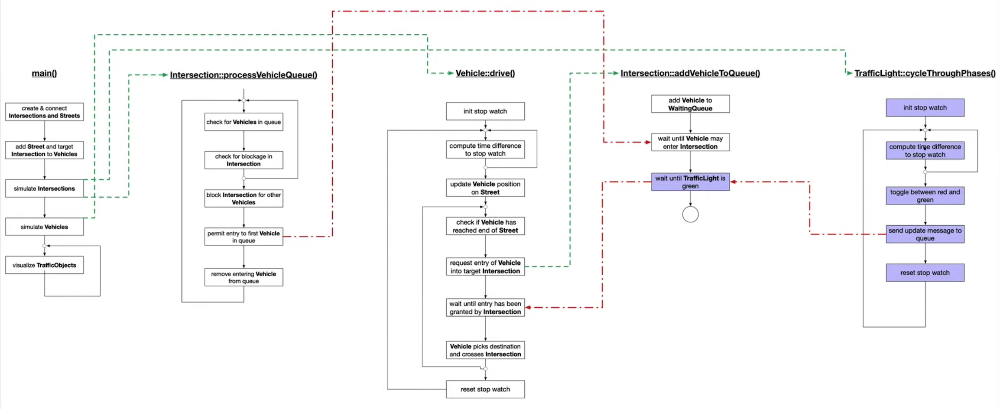

# Concurrent Traffic Simulation

This project adds traffic lights functionality to the udacity [starter code](https://github.com/udacity/CppND-Program-a-Concurrent-Traffic-Simulation) to satisfy this [rubric](https://review.udacity.com/#!/rubrics/2640/view). The starter code already impements a traffic simulation in which vehicles are moving along streets and are crossing intersections. 

This update deals with increasing traffic in the city, where traffic lights are needed for road safety. Each intersection is therefore equipped with a traffic light. Also, this update builds a suitable and thread-safe communication protocol between vehicles and intersections to complete the simulation. In order to achieve that, concepts of concurrent programming (such as mutexes, locks and message queues) are used to implement the traffic lights and their integration into the code base.

Check this [video](https://www.youtube.com/watch?v=3Cddvt0tG_Y) for a simulation run.

## Project schematic

## Dependencies for Running Locally
* cmake >= 2.8
  * All OSes: [click here for installation instructions](https://cmake.org/install/)
* make >= 4.1 (Linux, Mac), 3.81 (Windows)
  * Linux: make is installed by default on most Linux distros
  * Mac: [install Xcode command line tools to get make](https://developer.apple.com/xcode/features/)
  * Windows: [Click here for installation instructions](http://gnuwin32.sourceforge.net/packages/make.htm)
* OpenCV >= 4.1
  * The OpenCV 4.1.0 source code can be found [here](https://github.com/opencv/opencv/tree/4.1.0)
* gcc/g++ >= 5.4
  * Linux: gcc / g++ is installed by default on most Linux distros
  * Mac: same deal as make - [install Xcode command line tools](https://developer.apple.com/xcode/features/)
  * Windows: recommend using [MinGW](http://www.mingw.org/)

## Basic Build Instructions

1. Clone this repo.
2. Make a build directory in the top level directory: `mkdir build && cd build`
3. Compile: `cmake .. && make`
4. Run it: `./traffic_simulation`.
